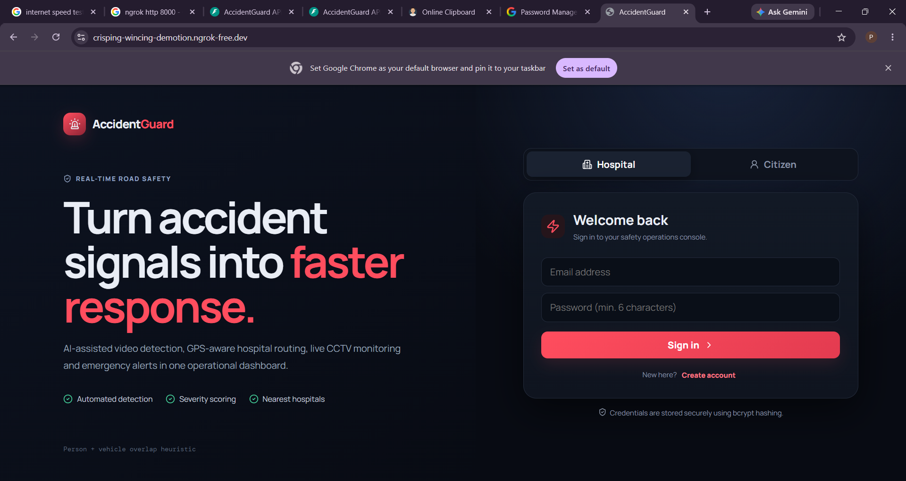
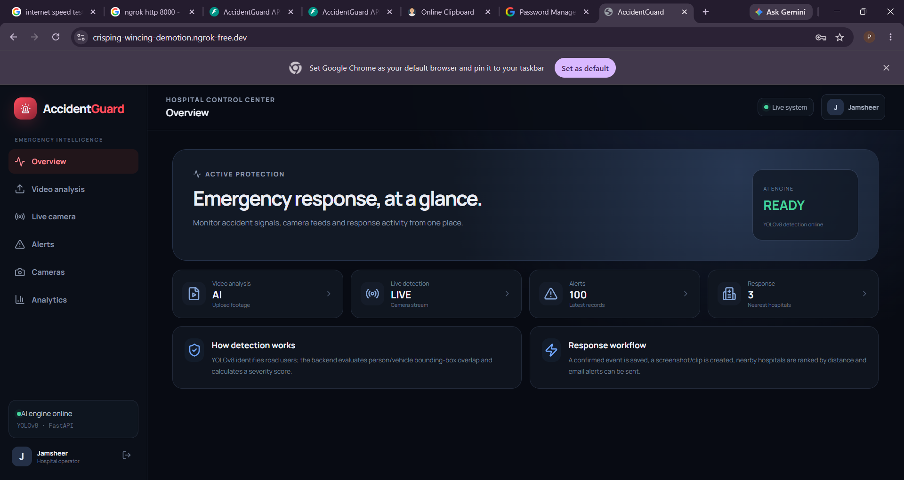
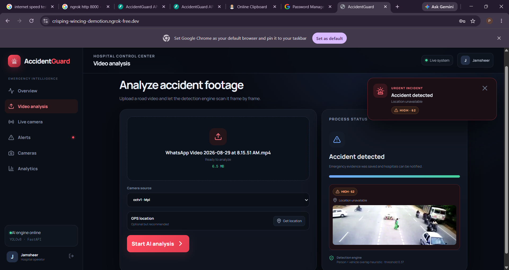
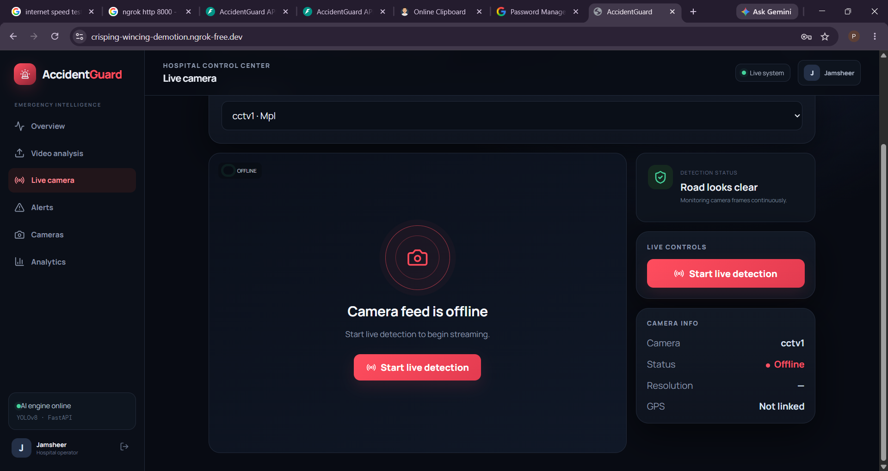
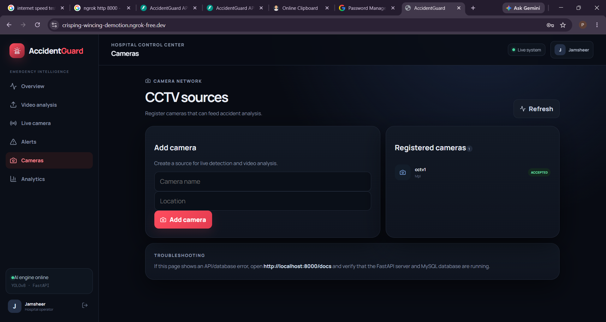
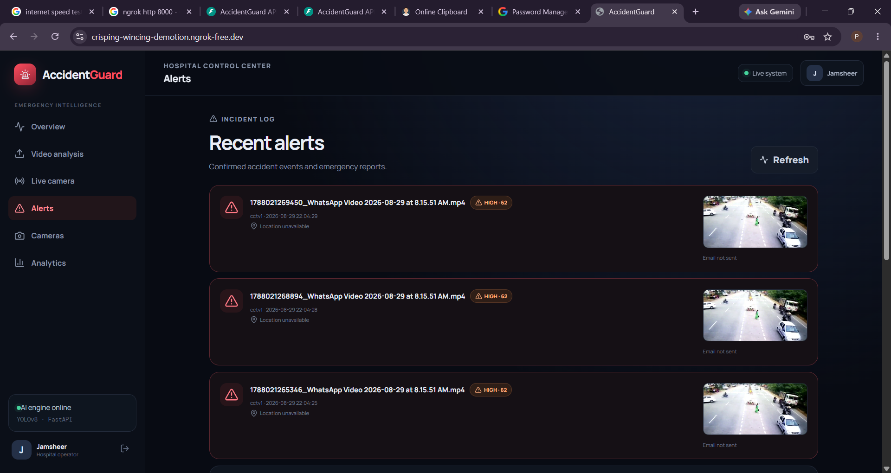
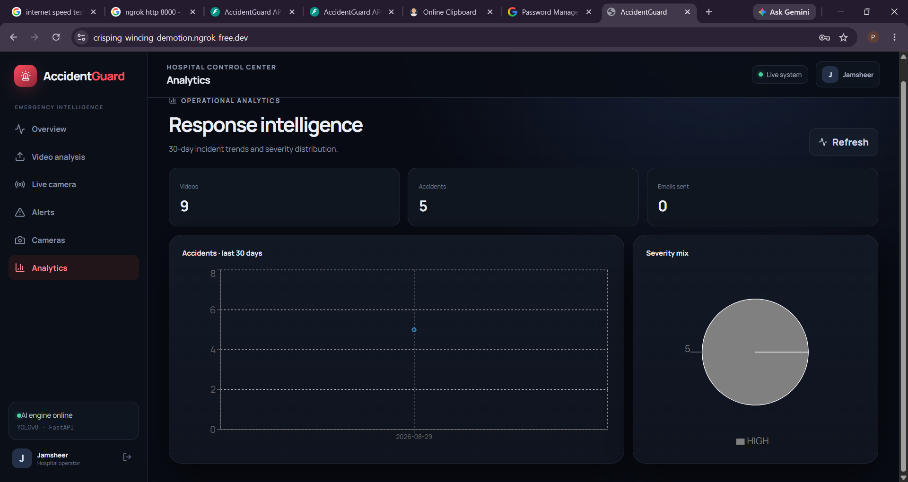
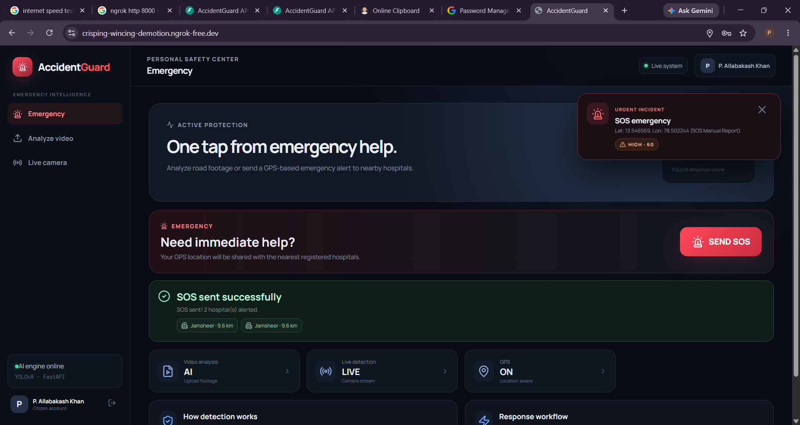

# 🚨 AccidentGuard

## AI-Powered Accident Detection & Emergency Response Platform

AccidentGuard is a full-stack accident detection and emergency response platform designed to help identify potential road accidents from video and live camera feeds and support faster emergency response.

The system combines **YOLOv8 computer vision, FastAPI, React.js, MySQL, WebSockets, GPS location services, severity analysis, hospital discovery, and email notifications** into a single web-based platform.

The project supports two types of users:

- 🏥 Hospital operators
- 👤 Citizens

---

# 📌 Table of Contents

- [Project Overview](#-project-overview)
- [Key Features](#-key-features)
- [How the System Works](#-how-the-system-works)
- [Technology Stack](#-technology-stack)
- [Project Architecture](#-project-architecture)
- [Project Structure](#-project-structure)
- [Database](#-database)
- [Prerequisites](#-prerequisites)
- [Installation](#-installation)
- [Backend Setup](#-backend-setup)
- [Frontend Setup](#-frontend-setup)
- [Running the Project](#-running-the-project)
- [API Documentation](#-api-documentation)
- [AI Accident Detection](#-ai-accident-detection)
- [Severity Detection](#-severity-detection)
- [Live Camera Detection](#-live-camera-detection)
- [GPS and Nearby Hospitals](#-gps-and-nearby-hospitals)
- [SOS Emergency System](#-sos-emergency-system)
- [Email Notifications](#-email-notifications)
- [Analytics](#-analytics)
- [Evidence Generation](#-evidence-generation)
- [Testing](#-testing)
- [Temporary Deployment with ngrok](#-temporary-deployment-with-ngrok)
- [Production Deployment](#-production-deployment)
- [Environment Variables](#-environment-variables)
- [Security](#-security)
- [Limitations](#-limitations)
- [Future Enhancements](#-future-enhancements)
- [Troubleshooting](#-troubleshooting)
- [Project Workflow](#-project-workflow)
- [License](#-license)

---

# 📖 Project Overview

Road accidents require rapid identification and emergency response.

AccidentGuard attempts to reduce the delay between accident detection and emergency notification by combining computer vision with GPS-based hospital discovery and real-time communication.

The platform allows users to:

1. Upload road/accident videos.
2. Analyze video frames using YOLOv8.
3. Detect people and vehicles.
4. Evaluate possible person/vehicle overlap.
5. Calculate an accident severity score.
6. Capture accident evidence.
7. Generate accident clips.
8. Identify nearby hospitals.
9. Send emergency email notifications.
10. Monitor live camera feeds.
11. Receive real-time detection events.
12. Send GPS-based SOS alerts.
13. View alerts and analytics.

---

# ✨ Key Features

## 🔐 Authentication

The platform provides authentication for two user types.

### 🏥 Hospital

Hospital operators can:

- Register an account.
- Log in securely.
- Register CCTV cameras.
- View registered cameras.
- Monitor live camera detection.
- Upload and analyze videos.
- View accident alerts.
- View accident evidence.
- View accident severity.
- View analytics.
- Receive emergency email notifications.

### 👤 Citizen

Citizens can:

- Register.
- Log in.
- Analyze road videos.
- Use browser camera detection.
- Share GPS location.
- Send emergency SOS alerts.
- Find nearby registered hospitals.

---

# 🤖 AI Accident Detection

AccidentGuard uses **Ultralytics YOLOv8** for object detection.

The model currently used by the project is:

```text
backend/yolov8n.pt
```

The detection system identifies objects such as:

- Person
- Car
- Motorcycle
- Truck
- Bus

The current accident detection approach evaluates the spatial relationship between detected people and vehicles.

The overall pipeline is:

```text
Input Video
     │
     ▼
Video Frame Extraction
     │
     ▼
YOLOv8 Object Detection
     │
     ├── Person Detection
     │
     └── Vehicle Detection
     │
     ▼
Bounding Box Analysis
     │
     ▼
Person / Vehicle Overlap
     │
     ▼
Accident Decision
     │
     ▼
Severity Calculation
     │
     ▼
Evidence Generation
     │
     ▼
Hospital / Email Alerts
```

---

# ⚠️ AI Detection Note

The current implementation is a prototype accident-detection approach.

The accident decision is based on object detection and person/vehicle bounding-box overlap rather than a dedicated accident-classification model.

Therefore, the system should not be considered a safety-critical production accident detection system without further validation.

A production version should be evaluated using a large, representative accident dataset and a dedicated accident classification/tracking approach.

---

# 📊 Severity Detection

When a potential accident is detected, the system calculates a severity score.

The score can consider factors including:

- Bounding-box overlap
- Vehicle type
- Number of detected objects

The severity levels used by the project are:

| Score | Severity |
|---:|---|
| 0–34 | LOW |
| 35–54 | MEDIUM |
| 55–74 | HIGH |
| 75–100 | CRITICAL |

The final severity score is limited to a maximum of:

```text
100
```

---

# 🛠️ Technology Stack

## Frontend

| Technology | Purpose |
|---|---|
| React.js | User interface |
| Vite | Frontend build/development tool |
| JavaScript | Application logic |
| Lucide React | UI icons |
| Recharts | Analytics visualization |
| Browser Camera API | Live camera access |
| Geolocation API | GPS location |

---

## Backend

| Technology | Purpose |
|---|---|
| Python | Backend programming language |
| FastAPI | REST API framework |
| Uvicorn | ASGI server |
| WebSockets | Real-time communication |
| JWT | Authentication |
| bcrypt | Password hashing |
| Pydantic | Data validation |
| python-multipart | File upload support |

---

## Artificial Intelligence / Computer Vision

| Technology | Purpose |
|---|---|
| YOLOv8 | Object detection |
| Ultralytics | YOLO implementation |
| OpenCV | Video and image processing |
| NumPy | Numerical operations |
| Shapely | Geometric calculations |

---

## Database

```text
MySQL
```

MySQL stores:

- Hospital accounts
- Citizen accounts
- CCTV cameras
- Accident alerts
- Severity information
- GPS coordinates
- Email notification status

---

## Communication

The application uses:

- REST APIs
- WebSockets
- SMTP email

---

# 🧱 Project Architecture

```text
                    ┌─────────────────────────┐
                    │       React.js          │
                    │       Frontend          │
                    └────────────┬────────────┘
                                 │
                         REST API / WebSocket
                                 │
                                 ▼
                    ┌─────────────────────────┐
                    │        FastAPI          │
                    │        Backend          │
                    └────────────┬────────────┘
                                 │
              ┌──────────────────┼──────────────────┐
              │                  │                  │
              ▼                  ▼                  ▼
       ┌─────────────┐    ┌─────────────┐    ┌─────────────┐
       │   YOLOv8    │    │    MySQL    │    │ Gmail SMTP  │
       │   Engine    │    │  Database   │    │   Service   │
       └──────┬──────┘    └─────────────┘    └─────────────┘
              │
              ▼
       ┌─────────────┐
       │ OpenCV +    │
       │ Shapely     │
       └─────────────┘
```

---

# 📂 Project Structure

```text
Innovation Nexus/
│
├── README.md
│
├── backend/
│   │
│   ├── app/
│   │   ├── api/
│   │   ├── services/
│   │   │   ├── alerts.py
│   │   │   ├── detection.py
│   │   │   └── processing.py
│   │   │
│   │   ├── auth.py
│   │   ├── config.py
│   │   ├── db.py
│   │   ├── main.py
│   │   ├── schemas.py
│   │   └── websocket_manager.py
│   │
│   ├── storage/
│   │   ├── clips/
│   │   ├── screenshots/
│   │   └── uploads/
│   │
│   ├── yolov8n.pt
│   ├── requirements.txt
│   ├── run.py
│   └── .env.example
│
├── database/
│   ├── schema.sql
│   ├── migrate_existing.sql
│   └── seed_notes.sql
│
├── frontend/
│   │
│   ├── src/
│   │   ├── App.jsx
│   │   ├── main.jsx
│   │   ├── styles.css
│   │   └── lib/
│   │       └── api.js
│   │
│   ├── package.json
│   ├── package-lock.json
│   ├── index.html
│   └── .env.example
│
├── render.yaml
└── .gitignore
```

---

# 🗄️ Database

The application uses the MySQL database:

```text
accident_detection
```

## Main Tables

### hospitals

Stores hospital account and location information.

```text
id
name
email
password
location
phone
latitude
longitude
created_at
```

### users

Stores citizen account information.

```text
id
name
email
password
phone
latitude
longitude
created_at
```

### cameras

Stores CCTV camera information.

```text
id
name
location
status
hospital_id
created_at
```

Camera status values include:

```text
pending
accepted
rejected
```

### alerts

Stores accident and emergency events.

```text
id
camera_id
hospital_id
video_name
accident_detected
screenshot_path
accident_clip_path
location
email_sent
severity_label
severity_score
created_at
```

---

# 🧰 Prerequisites

Before installing AccidentGuard, install:

- Python 3.11 or newer
- Node.js 18 or newer
- npm
- MySQL 8 or newer
- Git

Optional:

- ngrok for temporary public access

---

# 📥 Installation

## 1. Clone the Repository

```bash
git clone <YOUR_GITHUB_REPOSITORY_URL>
```

Then:

```bash
cd "Innovation Nexus"
```

---

# 🖥️ Application Screenshots

## 🔐 Login & Registration

The authentication interface allows users to access the platform as either a hospital operator or citizen.



---

## 🏠 Dashboard

The dashboard provides quick access to accident detection, live camera monitoring, alerts, analytics, and emergency services.



---

## 🎥 Video Analysis

Users can upload road footage for AI-based accident detection and severity analysis.



---

## 📡 Live Camera Detection

The live camera module captures camera frames and sends them to the FastAPI backend through WebSockets for real-time AI analysis.



---

## 📷 CCTV Camera Management

Hospital operators can register and manage CCTV camera sources.



---

## 🚨 Accident Alerts

Detected incidents are displayed with accident information, severity, location, evidence, and notification status.



---

## 📊 Analytics

The analytics dashboard provides visual insights into accident trends and severity distribution.



---

## 🆘 Emergency SOS

Citizens can send an emergency SOS using their current GPS location to help identify nearby hospitals.



# 🗃️ Database Setup

Open MySQL Workbench or MySQL command line.

Create the database and tables using:

```text
database/schema.sql
```

You can also execute:

```sql
CREATE DATABASE accident_detection;
```

Then select it:

```sql
USE accident_detection;
```

Run the schema SQL file.

If you already have an older database version, use:

```text
database/migrate_existing.sql
```

to apply the required changes.

---

# 🐍 Backend Setup

Open PowerShell in the project root:

```powershell
cd "backend"
```

Create a Python virtual environment:

```powershell
python -m venv venv
```

Activate it:

```powershell
.\venv\Scripts\Activate.ps1
```

If PowerShell blocks activation, you can run the Python executable directly:

```powershell
.\venv\Scripts\python.exe run.py
```

Install backend dependencies:

```powershell
pip install -r requirements.txt
```

---

# ⚙️ Backend Environment Configuration

Inside the `backend` folder, copy:

```text
.env.example
```

to:

```text
.env
```

PowerShell:

```powershell
Copy-Item .env.example .env
```

Configure your environment variables.

Example:

```env
APP_NAME=AccidentGuard API
APP_ENV=development

SECRET_KEY=your-secret-key

FRONTEND_ORIGIN=http://localhost:5173

MYSQL_HOST=localhost
MYSQL_PORT=3306
MYSQL_USER=root
MYSQL_PASSWORD=YOUR_MYSQL_PASSWORD
MYSQL_DATABASE=accident_detection

SMTP_HOST=smtp.gmail.com
SMTP_PORT=465
SMTP_USER=yourgmail@gmail.com
SMTP_PASSWORD=YOUR_GMAIL_APP_PASSWORD
ALERT_FALLBACK_EMAIL=yourgmail@gmail.com

YOLO_MODEL_PATH=./yolov8n.pt
YOLO_CONFIDENCE=0.35
ACCIDENT_IOU_THRESHOLD=0.37
PROCESS_EVERY_N_FRAMES=5

UPLOAD_DIR=./storage/uploads
SCREENSHOT_DIR=./storage/screenshots
CLIP_DIR=./storage/clips

MAX_UPLOAD_MB=250
```

---

# 🔐 Gmail Configuration

If email alerts are enabled, use a Gmail App Password.

Do not use your normal Gmail password.

The required configuration is:

```env
SMTP_HOST=smtp.gmail.com
SMTP_PORT=465
SMTP_USER=yourgmail@gmail.com
SMTP_PASSWORD=your-app-password
ALERT_FALLBACK_EMAIL=yourgmail@gmail.com
```

Keep these credentials private.

---

# ▶️ Running the Backend

From:

```text
backend/
```

run:

```powershell
python run.py
```

The API will normally be available at:

```text
http://localhost:8000
```

---

# 🌐 Frontend Setup

Open another terminal.

Go to:

```powershell
cd "frontend"
```

Install dependencies:

```powershell
npm install
```

Create the environment file:

```powershell
Copy-Item .env.example .env
```

Configure:

```env
VITE_API_URL=http://localhost:8000
```

---

# ▶️ Running the Frontend

Run:

```powershell
npm run dev
```

Vite will display a URL similar to:

```text
http://localhost:5173/
```

Open it in your browser.

---

# 🏗️ Production Build

To build the React application:

```powershell
cd frontend
npm run build
```

The production files will be generated inside:

```text
frontend/dist/
```

If the FastAPI application is configured to serve the production frontend, the application can then be accessed through the FastAPI server.

---

# 📚 API Documentation

FastAPI automatically generates interactive Swagger documentation.

Start the backend and open:

```text
http://localhost:8000/docs
```

This provides an interactive interface for testing API endpoints.

---

# 🔌 Main API Endpoints

| Method | Endpoint | Purpose |
|---|---|---|
| GET | `/api/health` | Backend health check |
| POST | `/api/register` | Hospital registration |
| POST | `/api/login` | Hospital login |
| POST | `/api/user/register` | Citizen registration |
| POST | `/api/user/login` | Citizen login |
| GET | `/api/me` | Current user |
| POST | `/api/cameras/request` | Register camera |
| GET | `/api/cameras/my` | Get hospital cameras |
| POST | `/api/upload` | Upload video |
| GET | `/api/status/{alert_id}` | Get processing status |
| GET | `/api/alerts` | Get alerts |
| POST | `/api/sos` | Send SOS |
| GET | `/api/stats` | Get analytics |
| GET | `/api/hospitals/nearest` | Find nearby hospitals |
| WebSocket | `/ws` | Real-time events |

---

# 📡 Live Camera Detection

The Live Camera feature uses the browser camera and WebSockets.

The workflow is:

```text
Browser Camera
      │
      ▼
Video Frame Capture
      │
      ▼
JPEG Frame
      │
      ▼
WebSocket
      │
      ▼
FastAPI
      │
      ▼
YOLOv8
      │
      ▼
Detection Result
      │
      ▼
React Dashboard
```

The WebSocket endpoint is:

```text
/ws
```

The frontend periodically captures frames and sends them to the backend.

The backend processes the frames and returns detection events.

---

# 📍 GPS Location

The application can use the browser's Geolocation API.

GPS information can be used for:

- Accident location
- SOS location
- Nearby hospital discovery
- Hospital distance calculations

The coordinates are represented as:

```text
Latitude
Longitude
```

---

# 🏥 Nearby Hospital Detection

Registered hospitals can have GPS coordinates stored in the database.

When an emergency event occurs, the backend can identify nearby hospitals.

The workflow is:

```text
Accident/SOS
     │
     ▼
GPS Coordinates
     │
     ▼
Registered Hospitals
     │
     ▼
Distance Calculation
     │
     ▼
Nearest Hospitals
     │
     ▼
Emergency Notification
```

---

# 🚨 SOS Emergency System

Citizens can trigger an emergency SOS.

The workflow is:

```text
Citizen presses SOS
        │
        ▼
Browser requests GPS
        │
        ▼
Latitude + Longitude
        │
        ▼
FastAPI
        │
        ▼
Find nearby hospitals
        │
        ▼
Calculate distance
        │
        ▼
Send notification
        │
        ▼
Store alert
        │
        ▼
Notify hospital clients
```

---

# 📧 Email Notifications

AccidentGuard supports email notifications through SMTP.

Gmail configuration:

```env
SMTP_HOST=smtp.gmail.com
SMTP_PORT=465
```

Sender:

```env
SMTP_USER=yourgmail@gmail.com
```

Password:

```env
SMTP_PASSWORD=your-app-password
```

Fallback recipient:

```env
ALERT_FALLBACK_EMAIL=yourbackupemail@gmail.com
```

Email functionality depends on valid SMTP configuration.

---

# 📈 Analytics Dashboard

Hospital operators can view operational analytics.

The analytics section can display information such as:

- Total videos
- Total accidents
- Emails sent
- Accident trends
- Severity distribution
- Daily activity

The frontend uses:

```text
Recharts
```

for visualization.

---

# 🎥 Accident Evidence

When an accident is detected, the backend can create evidence files.

## Uploaded videos

```text
backend/storage/uploads/
```

## Accident screenshots

```text
backend/storage/screenshots/
```

## Accident clips

```text
backend/storage/clips/
```

The paths are associated with alert records in MySQL.

---

# 🧪 Testing

## Test Backend

Open:

```text
http://localhost:8000/api/health
```

The backend should return a successful health response.

---

## Test Swagger

Open:

```text
http://localhost:8000/docs
```

Use the Swagger interface to test API endpoints.

---

## Test Frontend

Open:

```text
http://localhost:5173
```

Then test:

1. Registration
2. Login
3. Dashboard
4. Video Analysis
5. Live Camera
6. Cameras
7. Alerts
8. Analytics
9. SOS
10. Email notifications

---

# 🌐 Temporary Public Deployment with ngrok

For demonstrations, the application can be temporarily exposed to the internet using ngrok.

## Start FastAPI

First start the backend:

```powershell
cd backend
.\venv\Scripts\Activate.ps1
python run.py
```

The backend should run on:

```text
http://localhost:8000
```

---

## Start ngrok

Open a second PowerShell terminal.

Run:

```powershell
ngrok http 8000
```

ngrok will provide a public HTTPS URL similar to:

```text
https://example.ngrok-free.dev
```

Use that URL to access the application if your FastAPI deployment is serving the frontend.

---

# ⚠️ ngrok Important Notes

The FastAPI terminal must remain running.

The ngrok terminal must also remain running.

If either process is closed, the temporary public URL will stop working.

The free ngrok URL may also change when a new tunnel is created.

---

# ☁️ Production Deployment

The repository contains:

```text
render.yaml
```

which can be used as part of deployment configuration.

For production deployment, configure environment variables through the hosting platform rather than committing `.env`.

Required configuration may include:

```text
MYSQL_HOST
MYSQL_PORT
MYSQL_USER
MYSQL_PASSWORD
MYSQL_DATABASE
SECRET_KEY
SMTP_USER
SMTP_PASSWORD
ALERT_FALLBACK_EMAIL
FRONTEND_ORIGIN
```

The frontend also requires:

```env
VITE_API_URL=<BACKEND_URL>
```

---

# 🔒 Security

Never commit secrets to GitHub.

Do not upload:

```text
backend/.env
```

The `.env` file may contain:

- Database passwords
- SMTP credentials
- JWT secret
- API keys

Use:

```text
backend/.env.example
```

for sharing configuration structure.

---

# 🚫 Files That Should Not Be Uploaded to GitHub

Do not commit:

```text
backend/venv/
frontend/node_modules/
backend/.env
backend/storage/uploads/
backend/storage/screenshots/
backend/storage/clips/
```

Large generated files and private credentials should remain outside the repository.

---

# 🔍 Verify Before GitHub Push

Run:

```powershell
git status
```

Check that sensitive files are not included.

If `.env` is already tracked by Git, remove it from tracking:

```powershell
git rm --cached backend/.env
```

Then commit the change.

---

# ⚠️ Project Limitations

AccidentGuard is currently a prototype/academic/innovation project.

The following limitations should be considered.

## AI limitations

The current accident detection logic uses object detection and spatial overlap heuristics.

It is not a fully trained accident classification model.

---

## CCTV limitations

The current browser live camera feature does not represent a complete production-grade IP CCTV/RTSP infrastructure.

---

## ETA limitations

Hospital ETA calculations may use approximate distance/travel assumptions and are not necessarily based on real-time traffic conditions.

---

## Storage limitations

Uploaded videos and generated evidence may be stored locally.

Production deployments should use persistent cloud/object storage.

---

## Safety limitations

This system should not be relied upon as the sole mechanism for emergency response.

A production system would require extensive validation, testing, monitoring, security hardening, and regulatory review.

---

# 🚀 Future Enhancements

Possible future improvements include:

- Dedicated accident classification model
- Custom accident dataset
- Accident tracking
- Real-time object tracking
- IP CCTV / RTSP integration
- Multiple simultaneous cameras
- Better false-positive reduction
- Real-time traffic-aware ETA
- Google Maps integration
- Ambulance integration
- SMS alerts
- WhatsApp notifications
- Push notifications
- Hospital response acknowledgement
- Cloud storage
- Redis-based WebSocket scaling
- Admin dashboard
- Advanced incident reports
- GPU inference
- Model performance monitoring
- Automated model retraining
- Advanced AI-based accident classification

---

# 🔄 Complete System Workflow

## Hospital Workflow

```text
Hospital Registration
        │
        ▼
Hospital Login
        │
        ▼
Hospital Dashboard
        │
        ├───────────────┐
        │               │
        ▼               ▼
 Register Camera     Upload Video
        │               │
        ▼               ▼
 Live Camera       YOLOv8 Analysis
        │               │
        │               ▼
        │         Accident Detection
        │               │
        │               ▼
        │        Severity Analysis
        │               │
        │               ▼
        │        Evidence Generation
        │               │
        └───────┬───────┘
                │
                ▼
          Alert Dashboard
                │
                ▼
          Email Notification
```

---

# 👤 Citizen Workflow

```text
Citizen Registration
        │
        ▼
Citizen Login
        │
        ▼
Emergency Dashboard
        │
        ├───────────────┐
        │               │
        ▼               ▼
 Analyze Video       Send SOS
        │               │
        ▼               ▼
    YOLOv8          GPS Location
        │               │
        ▼               ▼
 Accident Check    Find Hospitals
        │               │
        └───────┬───────┘
                │
                ▼
          Emergency Response
```

---

# 🧩 Core Components

| Component | Technology |
|---|---|
| Frontend | React.js + Vite |
| Backend | FastAPI |
| Database | MySQL |
| AI | YOLOv8 |
| Video Processing | OpenCV |
| Geometry | Shapely |
| Charts | Recharts |
| Icons | Lucide React |
| Authentication | JWT + bcrypt |
| Real-Time Communication | WebSockets |
| Location | Browser Geolocation API |
| Email | Gmail SMTP |
| Temporary Public Access | ngrok |
| Deployment Configuration | Render |

---

# 📦 Dependency Installation Summary

## Backend

```powershell
cd backend
python -m venv venv
.\venv\Scripts\Activate.ps1
pip install -r requirements.txt
python run.py
```

## Frontend

```powershell
cd frontend
npm install
npm run dev
```

## Production frontend

```powershell
cd frontend
npm run build
```

---

# 🆘 Troubleshooting

## `ModuleNotFoundError: No module named 'uvicorn'`

Activate the backend environment and install requirements:

```powershell
cd backend
.\venv\Scripts\Activate.ps1
pip install -r requirements.txt
```

---

## `ModuleNotFoundError: No module named 'mysql'`

Install the MySQL connector:

```powershell
pip install mysql-connector-python
```

Or reinstall all requirements:

```powershell
pip install -r requirements.txt
```

---

## `npm is not recognized`

Make sure Node.js is installed and restart PowerShell.

Check:

```powershell
node --version
npm --version
```

---

## React page is blank

Open browser developer tools:

```text
F12
```

Then select:

```text
Console
```

Look for red JavaScript errors.

---

## Backend API is not responding

Check:

```text
http://localhost:8000/api/health
```

Also verify that:

```powershell
python run.py
```

is still running.

---

## MySQL connection error

Check:

```env
MYSQL_HOST=localhost
MYSQL_PORT=3306
MYSQL_USER=root
MYSQL_PASSWORD=YOUR_PASSWORD
MYSQL_DATABASE=accident_detection
```

Also make sure the MySQL server is running.

---

## Live Camera does not work

Check:

- Browser camera permission
- HTTPS/public URL when required
- FastAPI server
- WebSocket connection
- Browser console
- Correct frontend API URL

---

## Email does not work

Verify:

```env
SMTP_HOST=smtp.gmail.com
SMTP_PORT=465
SMTP_USER=yourgmail@gmail.com
SMTP_PASSWORD=your-app-password
ALERT_FALLBACK_EMAIL=recipient@gmail.com
```

For Gmail, use an App Password rather than the normal account password.

---

# 🎯 Project Goal

The primary goal of AccidentGuard is to demonstrate how artificial intelligence, real-time communication, GPS services, and emergency response systems can be combined to create a technology-assisted accident response platform.

The project demonstrates the integration of:

```text
Artificial Intelligence
        +
Computer Vision
        +
Real-Time Communication
        +
GPS
        +
Hospital Network
        +
Emergency Alerts
        +
Web Application
        +
Database
```

---

# 🏆 Project Highlights

AccidentGuard demonstrates a complete full-stack AI application involving:

- Computer vision
- YOLOv8 object detection
- Video processing
- Real-time WebSockets
- React.js frontend
- FastAPI backend
- MySQL database
- GPS-based hospital discovery
- Emergency SOS
- Email notifications
- Accident evidence generation
- Severity scoring
- Analytics dashboard

---

# 📜 License

See the project's `LICENSE` file for the applicable license.

---

# 👨‍💻 AccidentGuard

### AI-Based Accident Detection & Emergency Response System

Built with:

**React.js • FastAPI • MySQL • YOLOv8 • OpenCV • WebSockets • GPS • SMTP**

---